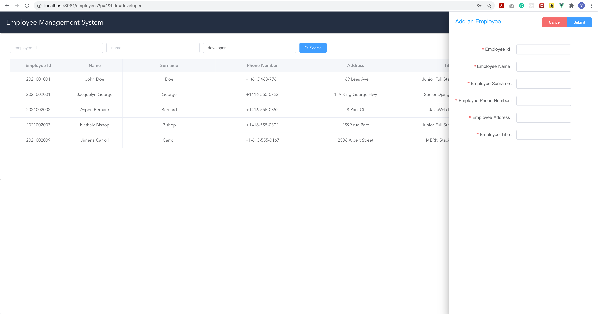
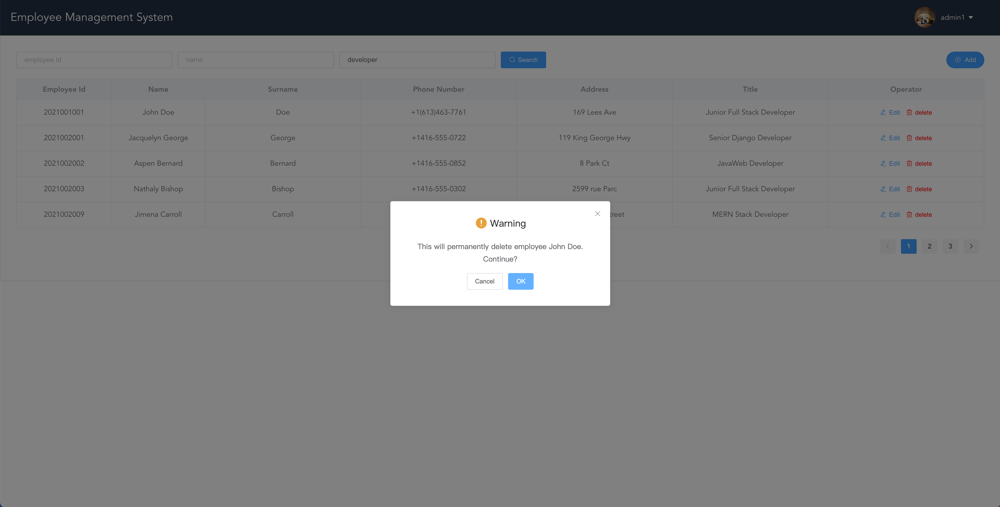
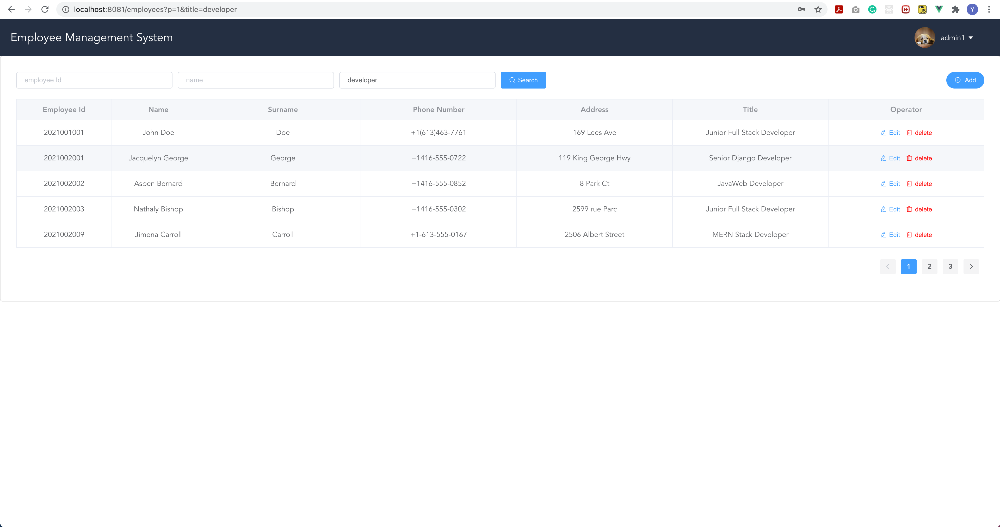
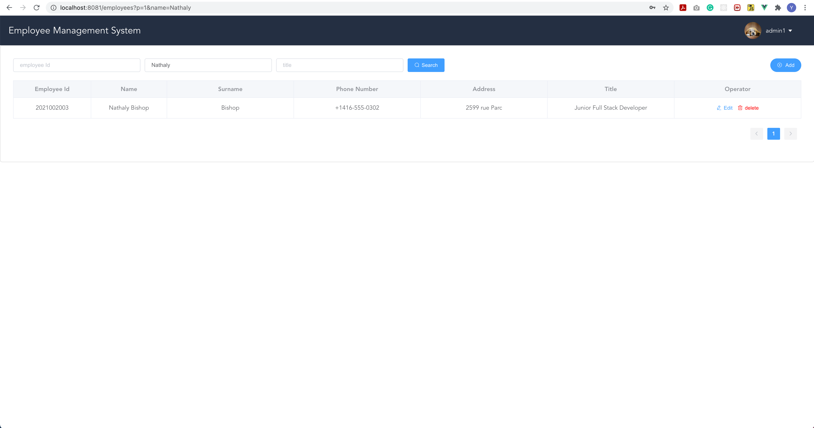
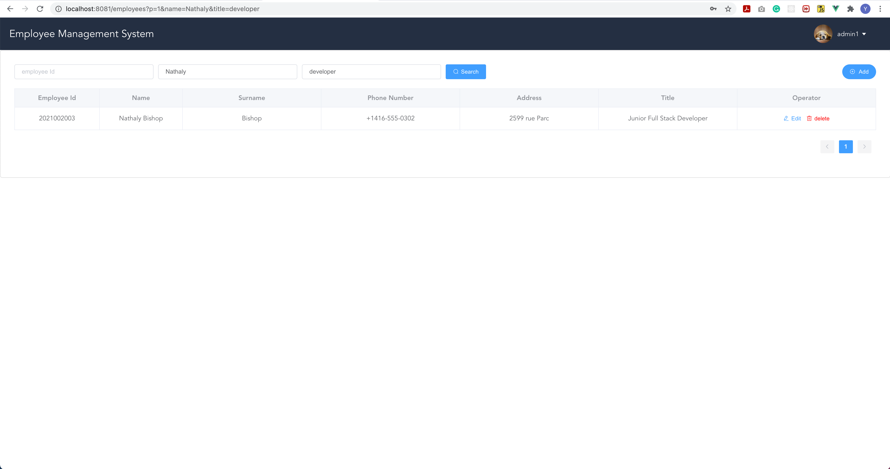
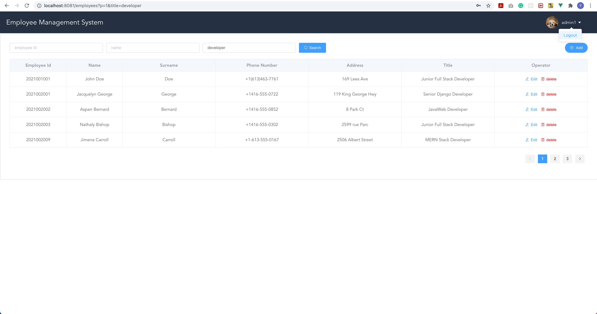

# Employee Management System

> This repository is the backend service of Employee Management System (EMS)
> 
> For frontend service, please visit https://github.com/YuKangYin1997/BrightZone-Frontend

## Features

- Login to system as an administrator
- Add a new employee
- Edit an employee
- Delete an employee
- List and filter employees according to combination of different criteria

## Requirements

- SpringBoot 2.3.9.RELEASE
- MySQL 8.0

## Backend Service Setup

1. Run `init.sql` at `src/main/resources/db/init.sql` to initialize the `ems` database and populate data.
   The resulting database consists of：
   - 2 admin users (123456 is their default passwords)
   - 25 employees
    
2. start backend service at http://localhost:8080

## Sample

1. login
   
   
2. add an employee
   

3. edit an employee
   

4. delete an employee
   
   
5. filter employee by title
   
   
6. filter employee by name
   
   
7. filter employee by name and title
   
   
8. logout
   